# Connor Hay Portfolio Assignment

## Links

---

- My Portfolio Site:
  [connorhay.com](https://connorhay.com)
   
- My GitHub Repo:
  [Portfolio Github Repo](https://github.com/ConnorCoderAcademy/portfolio-assignment-t1)
   
- My Slide Deck Recording:
  [Youtube Link Here](https://youtu.be/w5GsnjkvVVo)

## Purpose

---

The purpose of this portfolio is to develop a website which highlights me professionally and personally.  
It is a planned, polished, and precise summary of my skills, technical knowledge, and personal characteristics as a potential future employee.

## Functionality and Features

---

I incorprated a variety of features into my website:

<ul>

<li>I created a scrollable div to house the main content of some of the pages. This was a purely stylistic choice, as I like the aesthetic of a seperate scrollable area, packaged neatly in a flexable and sleek box.</li>
 
<li>When hovering over the navigation bar items, they smoothly fade to a grey colour to let the user know they are about to select the nav bar item.</li>
 
<li>The nav bar items change colour depending on which page you are on to let you know which page you are on.</li>
 
<li>I added a blinking cursor to the home page to add a touch of dynamism and life to the design.</li>
 
<li>I used white for the text colour against a solid grey-purple background to allow for greater contrast and easier legibility for people with site issues.</li>
 
<li>I used different font sizes for different media enquiries to ensure legibility on phone, table, and PC sizes, while still maintaining aesthetic integrity.</li>
 
<li>I opted to make use of the whole screen for the blog section, as it more closely matched traditional blog layouts. I felt the extra screen real estate was more important since the blog is content dense.</li>
 
<li>I added minimalist icons to my social media profiles in the footer. These icons are easily recognisable and maintained the aesthetic integrity of the site.</li>
 
<li>I used tailored CSS styling for phone, tablet and PC view port sizes to ensure functional and aesthetic integrity are maintained no matter which device the site is viewed on.</li>

# Target Audience

---

<ol> 
<li>Future Potential Employers</li>
<bre> 
<li>Future Potential Clients</li>
</ol>

# Tech Stack Utilised

---

<ul>
#### <li>HTML</li>
#### <li>CSS</li>
#### <li>SASS</li>
#### <li>Figma</li>
#### <li>Visual Studio Code</li>
#### <li>Netlify</li>
#### <li>GitHub</li>

# Screenshots of the Site

---

### PC View ー

Home Page:

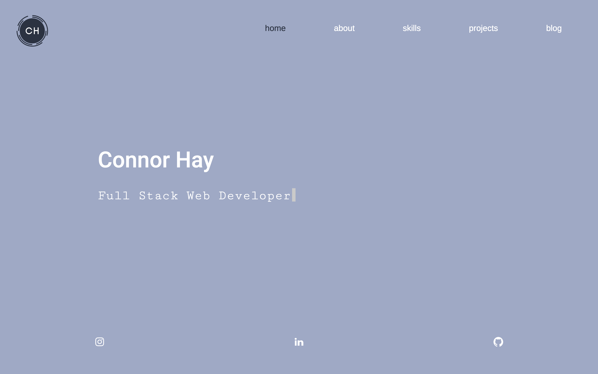
 
About Page:

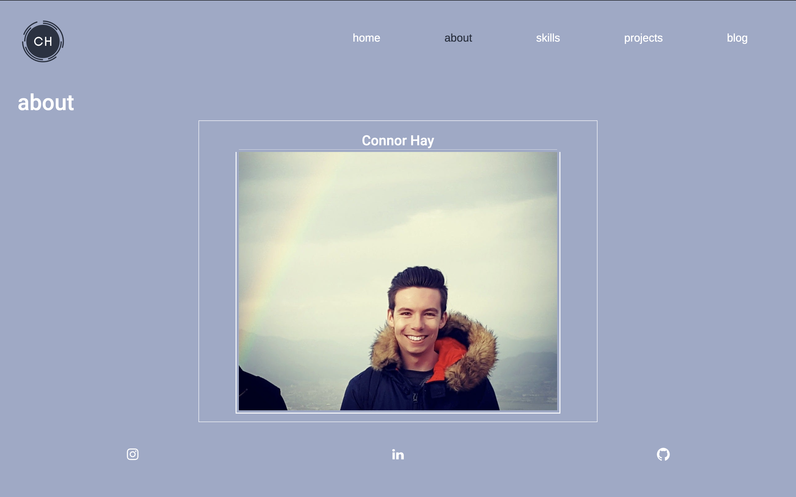
 
Skills Page:

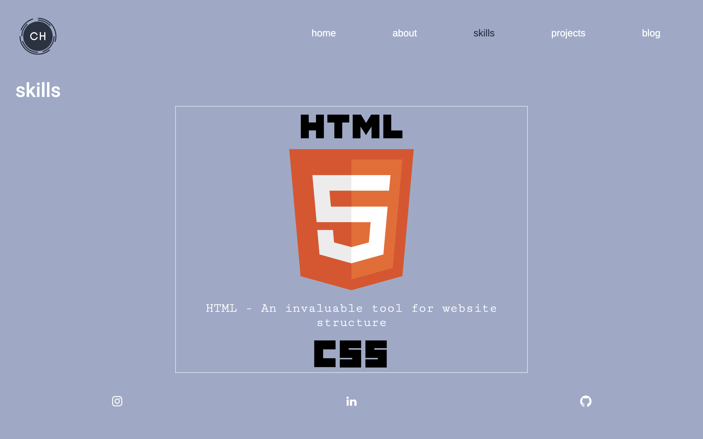
 
Projects Page:

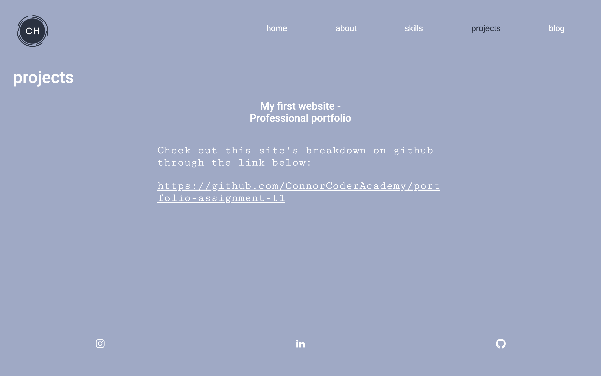
 
Blog Page:

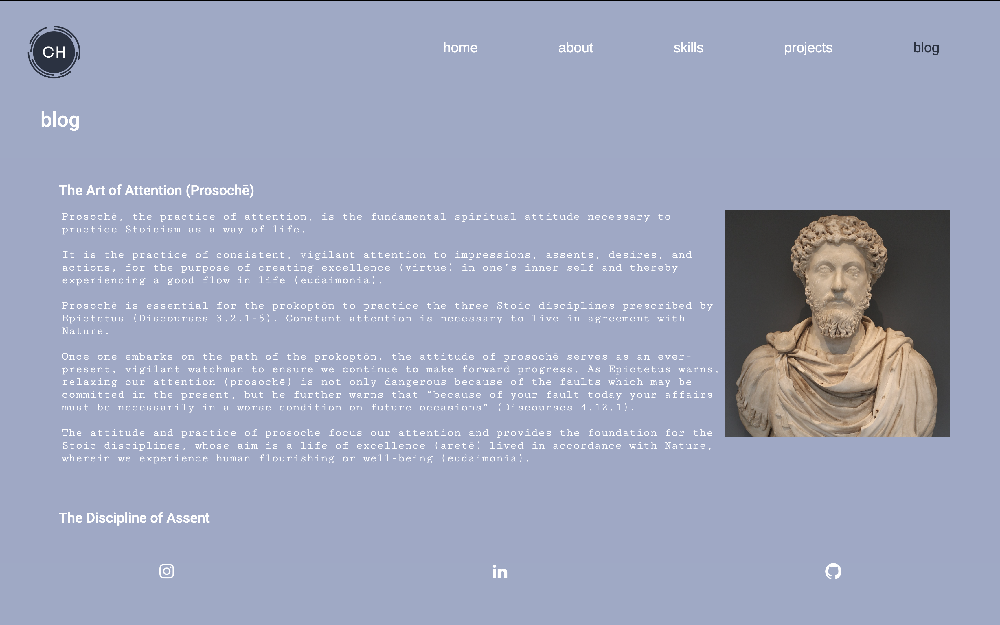

### Tablet View ー

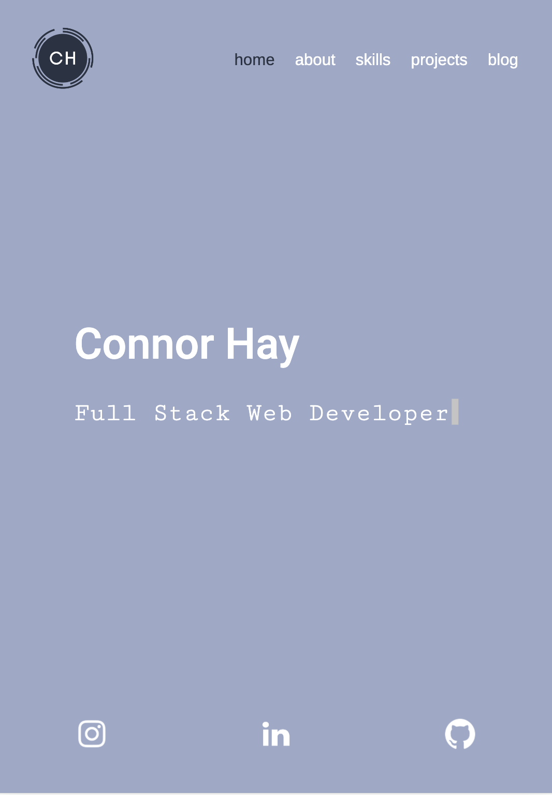
 
About Page:

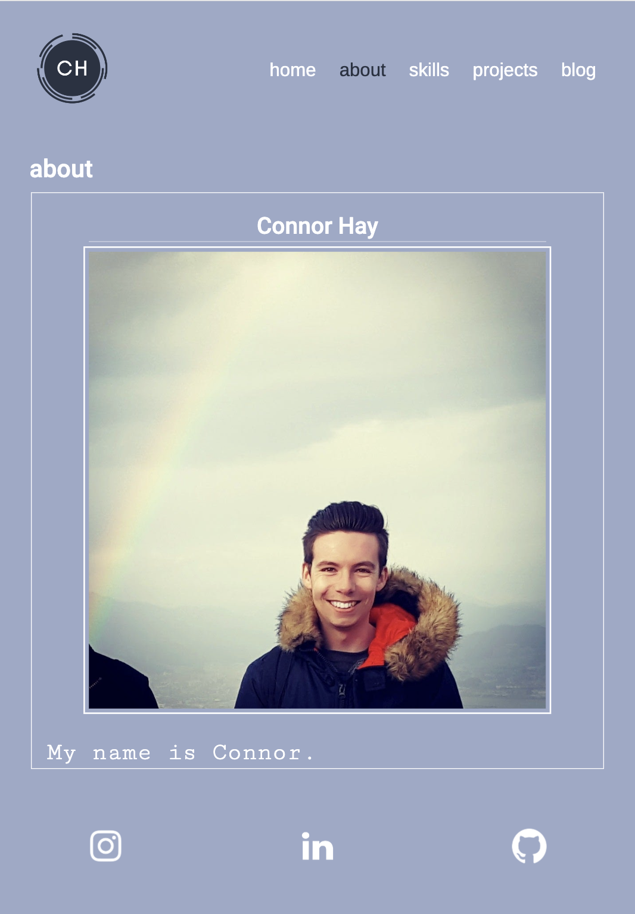
 
Skills Page:

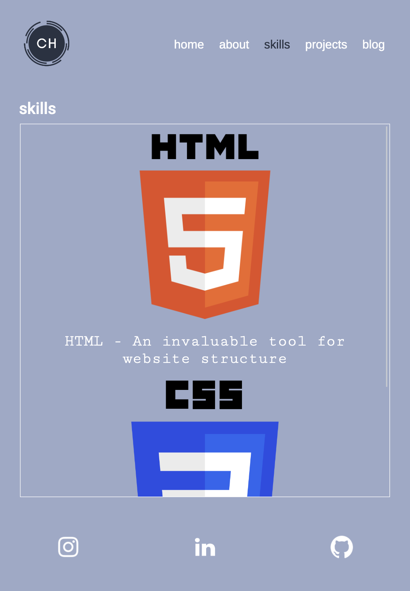
 
Projects Page:

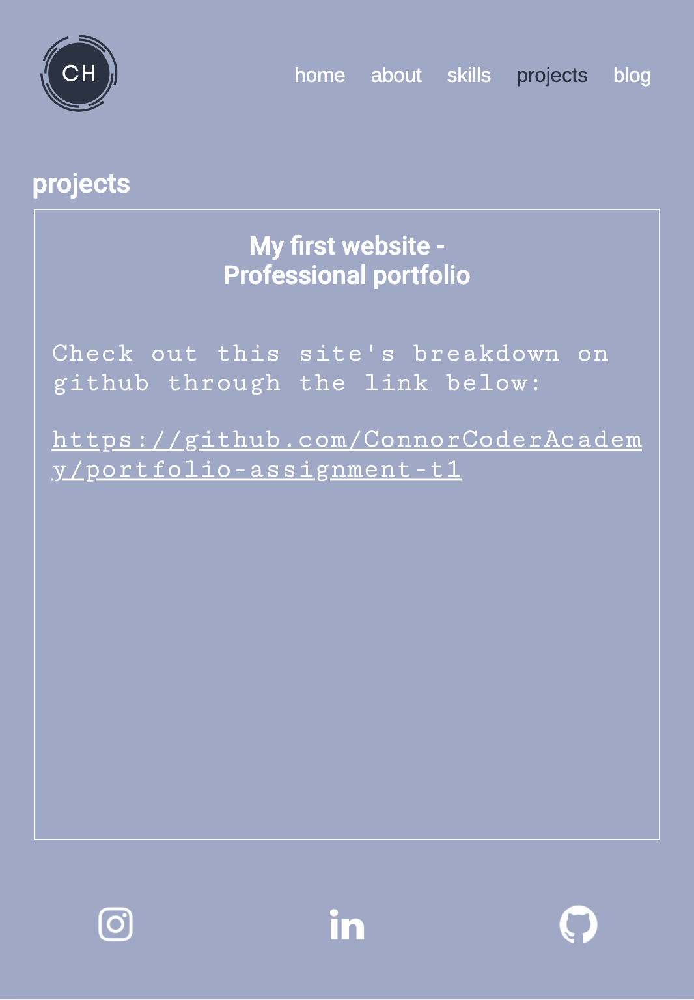
 
Blog Page:

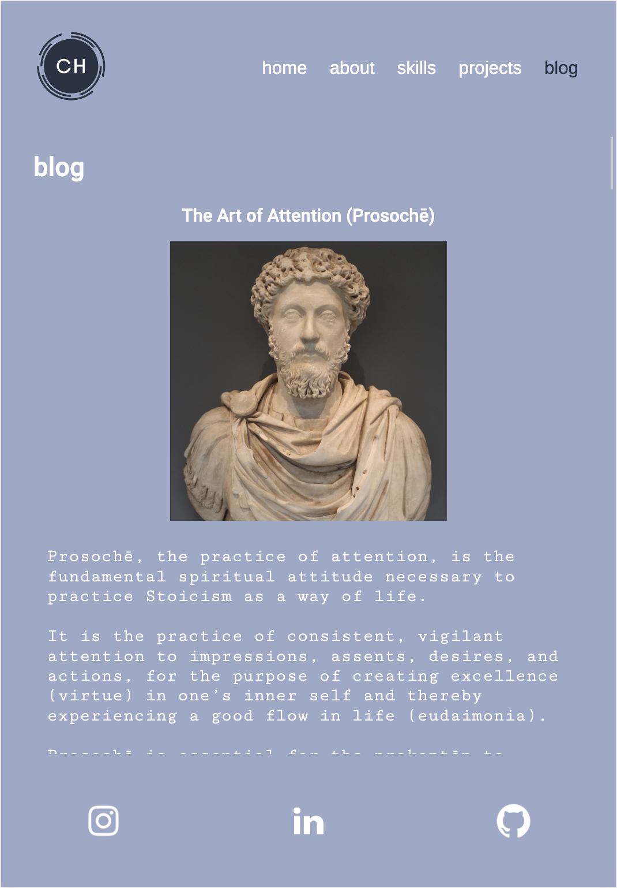

### Phone View ー

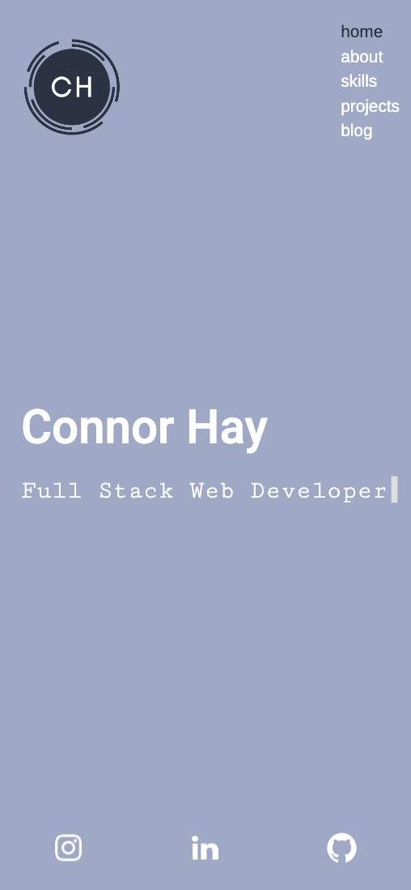
 
About Page:

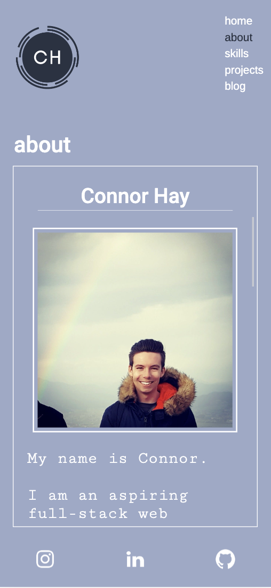
 
Skills Page:

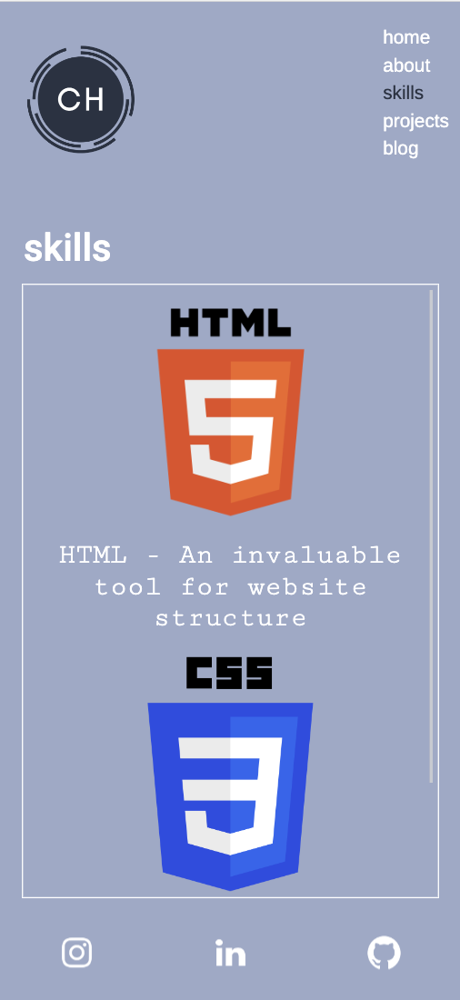
 
Projects Page:

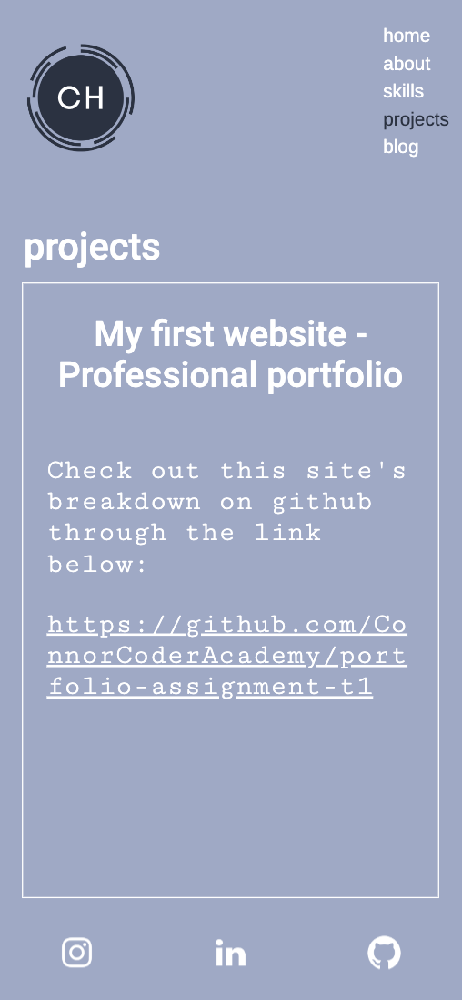
 
Blog Page:

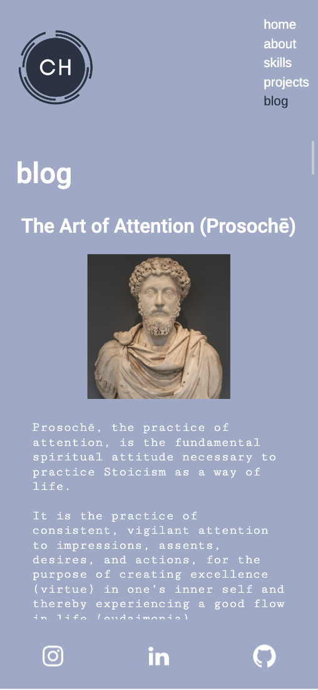
